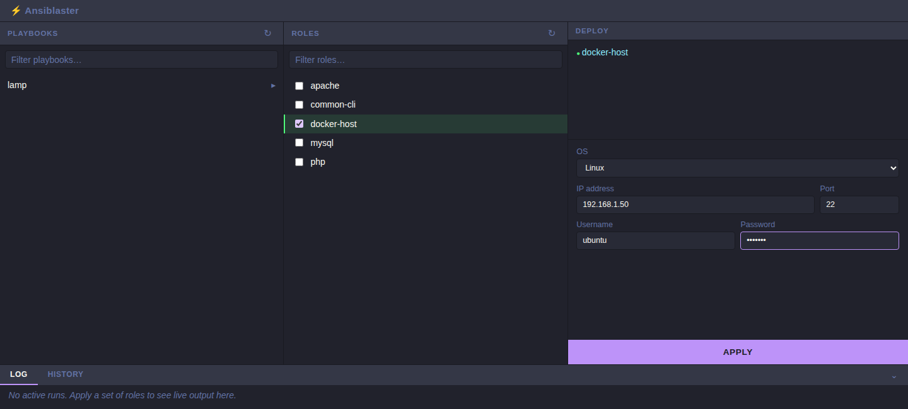

# AnsiBlaster

[](https://github.com/bamhm182/AnsiBlaster/actions/workflows/docker-publish.yml)

> ## ⚠️ Vibe-coded software — read before you run this
>
> **This entire project was built by an AI coding assistant (Claude) from a conversation with
> one person, with no professional security review, no production hardening pass, and no
> external audit.** It has automated tests, but those tests mock out the actual Ansible
> execution — there is no guarantee the real, end-to-end behavior is safe, correct, or fit for
> any particular purpose.
>
> A few concrete things worth knowing before you point this at anything you care about (see
> [`CLAUDE.md`](CLAUDE.md) for the full reasoning behind each):
>
> - **SSH host key checking is disabled** and **WinRM certificate validation is ignored** for
>   every connection this app makes, by design, so it can connect to a brand-new IP with no
>   setup. That also means it will not detect a man-in-the-middle or a spoofed host.
> - **The sudo/become password is assumed to be the same as the login password** on Linux
>   targets. There is no separate credential for privilege escalation.
> - This app runs **arbitrary Ansible roles you point it at, as root/Administrator, against
>   whatever host you type in** — it has no allowlisting, sandboxing, or confirmation step
>   beyond the "Apply" button.
> - It has **not** been tested against real Windows/WinRM targets, only Linux, and only in
>   limited manual smoke testing — not a real deployment.
>
> Treat this as a hobby project / starting point, not as trusted infrastructure tooling.
> Read the code before you rely on it, especially anything touching credentials or the
> target host connection.
>
> If you need something production-ready and actively maintained instead, look at
> [**AWX**](https://github.com/ansible/awx) (Red Hat's open-source upstream for Ansible
> Automation Platform, formerly Ansible Tower) or [**Semaphore**](https://semaphoreui.com/)
> — both are real projects with real security postures, built for exactly this kind of job.

AnsiBlaster is a small web UI for applying Ansible roles to a single target host on demand:
point it at a directory of Ansible roles, check the ones you want, type in a target's
IP/port/username/password, and hit **Apply** — it runs the selected roles against that host via
[`ansible-runner`](https://ansible.readthedocs.io/projects/runner/) and streams the live log
back to your browser.



## Features

- **Role checklist**, auto-discovered from a configured roles directory (no manual registration)
- **Playbooks as presets** — a YAML file listing roles (just like a normal Ansible playbook)
  becomes a one-click button that checks all of its roles at once; you can still add/remove
  individual roles before applying
- **Linux (SSH) and Windows (WinRM) targets**, password-based auth for both
- **Live log streaming** over Server-Sent Events, no polling
- **Concurrent runs** — start several jobs against different hosts at once
- **Run history**, persisted across restarts (SQLite), with full logs available afterward
- Ships as a **Docker image** (with a `docker-compose.yml` and a bundled example LAMP stack) or
  runnable directly from a clone

## Quick start

### Docker Compose (recommended)

```bash
git clone <this repo>
cd AnsiBlaster
cp .env.example .env
docker compose up -d
```

Then open <http://localhost:8000>. By default it points at the bundled
[`example/`](example/README.md) LAMP stack (Ubuntu/Debian `apache`/`mysql`/`php` roles + a
`lamp.yml` playbook preset) so there's something to try immediately. Edit `.env` (see
`.env.example`) to point `HOST_ROLES_DIR`/`HOST_PLAYBOOKS_DIR` at your own roles/playbooks
instead, and to set `PUID`/`PGID` to match the host user that owns them.

### Plain `docker run`

Using the [published image](https://hub.docker.com/r/bamhm182/ansiblaster) (built and pushed
automatically by CI — see [`CLAUDE.md`](CLAUDE.md#distribution)):

```bash
docker run -p 8000:8000 \
  -v /path/to/your/roles:/opt/ansible/roles \
  -v ansiblaster-data:/opt/ansiblaster \
  bamhm182/ansiblaster:latest
```

Or build it yourself from a clone:

```bash
docker build -t ansiblaster .
docker run -p 8000:8000 \
  -v /path/to/your/roles:/opt/ansible/roles \
  -v ansiblaster-data:/opt/ansiblaster \
  ansiblaster
```

### From a clone, no Docker

Requires [`uv`](https://github.com/astral-sh/uv), plus `sshpass` and an `ssh` client installed
locally (for Linux/SSH targets — see [`CLAUDE.md`](CLAUDE.md) for why both are needed).

```bash
git clone <this repo>
cd AnsiBlaster
uv sync
uv run ansiblaster
```

This reads roles from `/opt/ansible/roles` by default — create a `config.yaml` (or set
`ANSIBLASTER_ANSIBLE__ROLES_PATH`) to point somewhere else. See the next section.

## Configuration

Settings live in an optional `config.yaml`, overridable via `ANSIBLASTER_*` environment
variables. Nothing is required to start the app — every setting has a default.

```yaml
server:
  host: "0.0.0.0"
  port: 8000

ansible:
  roles_path: /opt/ansible/roles
  playbooks_path: /opt/ansible/playbooks
  artifacts_path: /opt/ansiblaster/artifacts

database:
  path: /opt/ansiblaster/ansiblaster.db

logging:
  level: INFO

defaults:
  ssh:
    username: ""
    password: ""
  winrm:
    username: ""
    password: ""
  psrp:
    username: ""
    password: ""
```

`defaults.ssh`/`defaults.winrm`/`defaults.psrp` just pre-fill the target form's username/
password fields for that connection preset — convenience, not a stored credential (see the
warning above: nothing you submit is persisted past the life of that run); each is independent,
so leaving one unset just leaves those fields blank rather than falling back to another. Env
var overrides follow the config file's nesting with `__`, e.g. `ANSIBLASTER_SERVER__PORT`,
`ANSIBLASTER_ANSIBLE__ROLES_PATH`,
`ANSIBLASTER_DEFAULTS__SSH__PASSWORD`. Full reference in [`CLAUDE.md`](CLAUDE.md#configuration-file).

## Development

This repo was built and is documented for AI coding assistants — see [`CLAUDE.md`](CLAUDE.md)
for the architecture, data model, module layout, and commands (`uv sync`, `uv run pytest`,
`uv run ruff check .`). That's also the fastest way for a human contributor to get oriented.

## License

[MIT](LICENSE)
